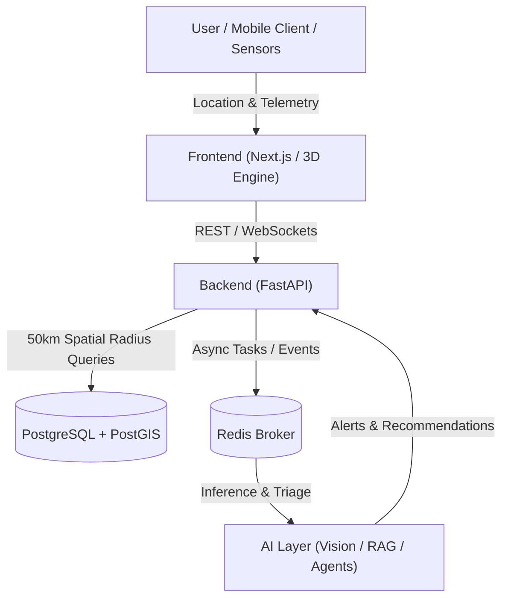

# UrbanPulse System Architecture Overview

## 1. Vision & Goals
UrbanPulse is a real-time urban intelligence platform with an initial geographic focus on **Mysuru** and **Bengaluru**. The platform monitors, analyzes, and predicts urban incidents and metrics within a **50 km geographic radius**.

## 2. Spatial Intelligence Pipeline (50 km Radius)
- **Live User Location**: Extracted via browser/device geolocation and matched against known city bounding polygons.
- **City Detection**: Deterministic lookup between Mysuru and Bengaluru coordinates.
- **50 km Spatial Bounding**: All incidents, road conditions, traffic choke points, and environmental readings are queried via PostGIS `ST_DWithin` using metric geography projection.

## 3. Incident Domains
- **Road Infrastructure**: Potholes, road degradation, active construction.
- **Traffic & Mobility**: Dynamic routing, congestion bottlenecks, vehicle accidents.
- **Emergency Hazards**: Urban flooding, waterlogging, fire incidents.
- **Environment & Civic**: Cleanliness / garbage dumping, fallen trees, AQI.
- **AI Triage**: Automated verification via computer vision and municipal RAG guidelines.
